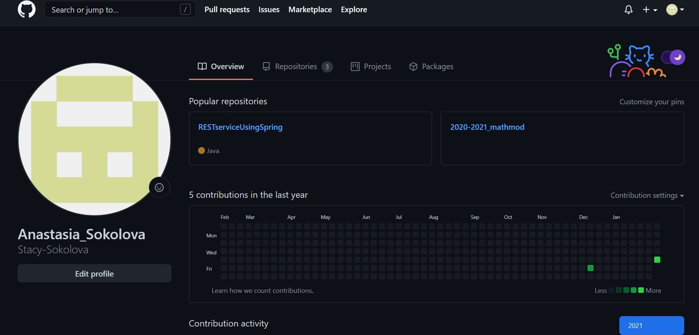
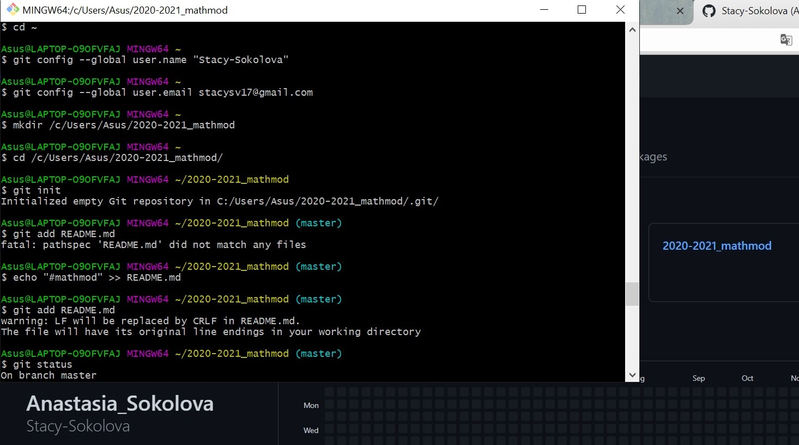
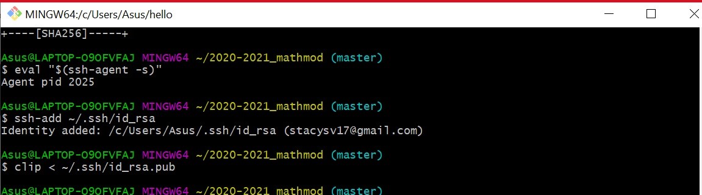
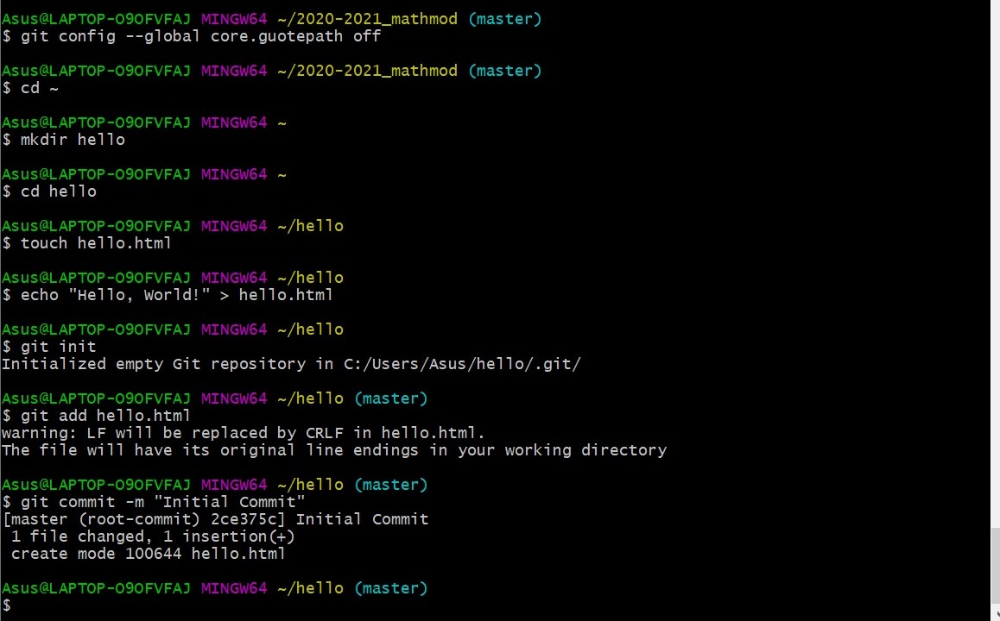
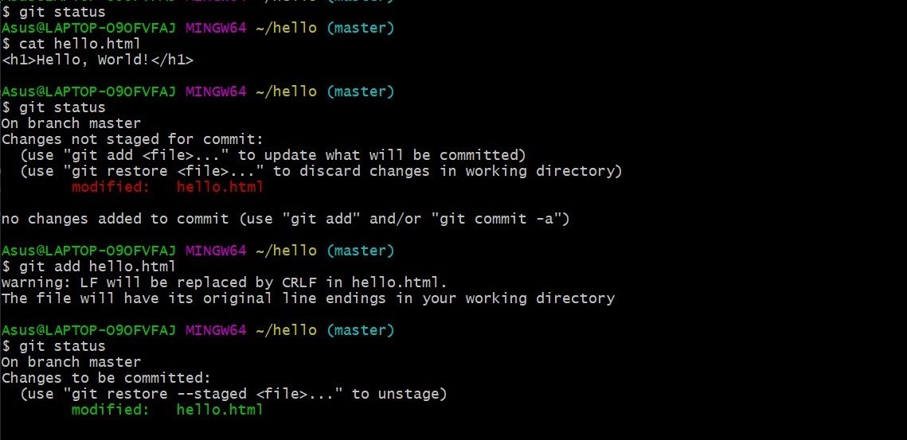
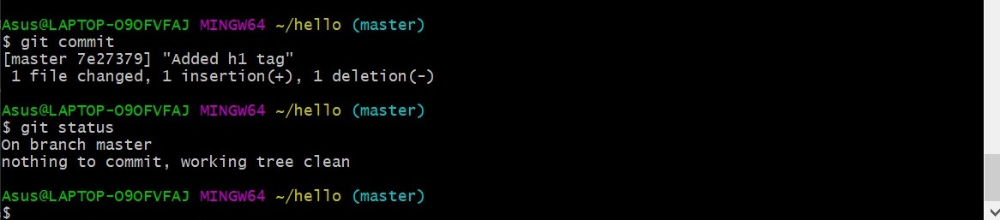
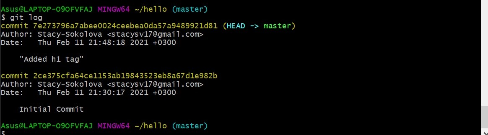
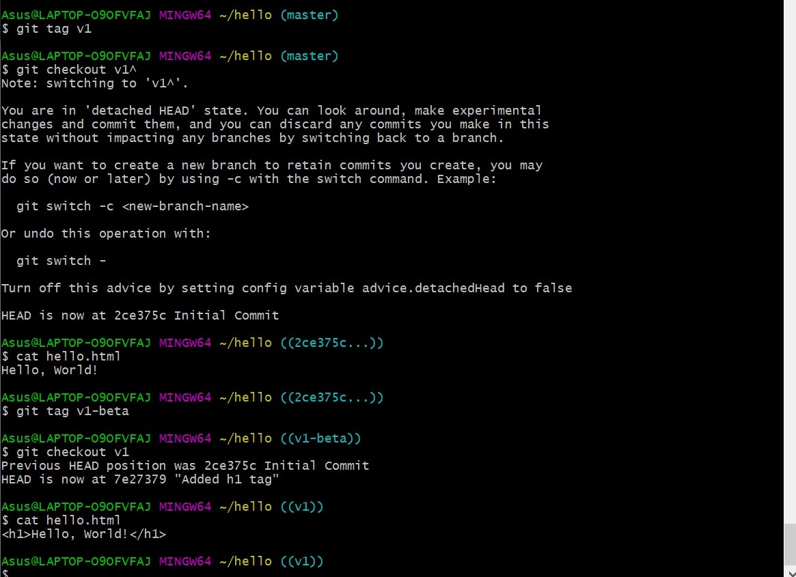
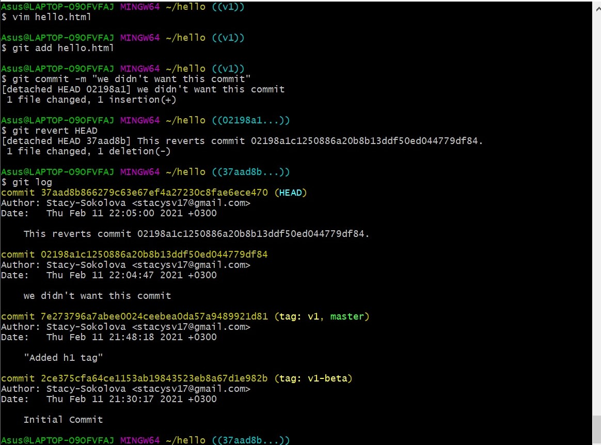
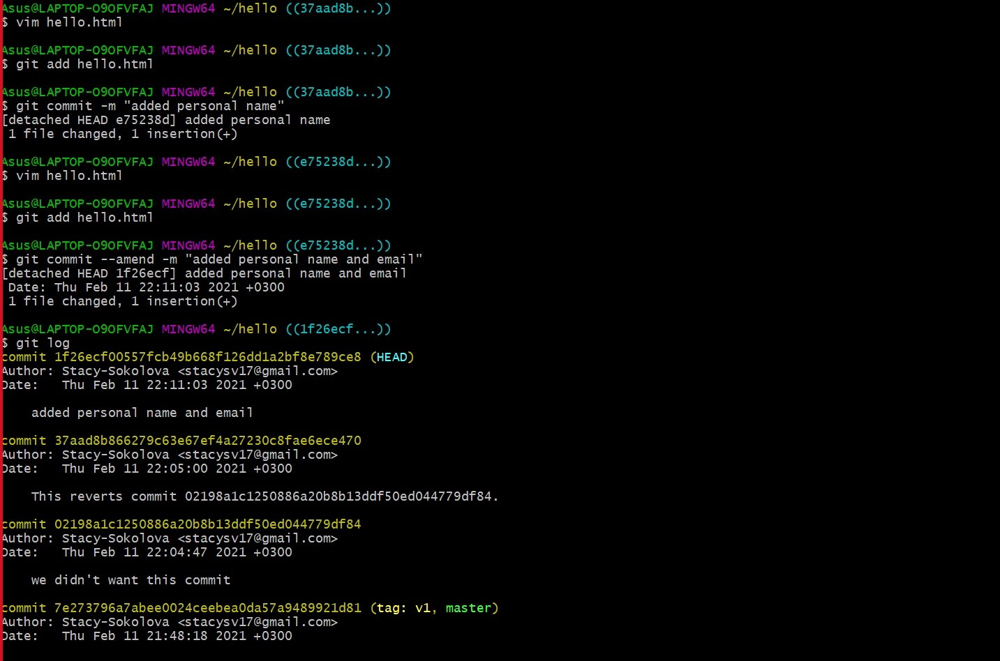

---
# Front matter
lang: ru-RU
title: "Отчёт по лабораторной работе №1"
subtitle: "Работа с git"
author: "Соколова Анастасия Витальевна"

# Formatting
toc-title: "Содержание"
toc: true # Table of contents
toc_depth: 2
lof: true # List of figures
lot: true # List of tables
fontsize: 12pt
linestretch: 1.5
papersize: a4paper
documentclass: scrreprt
polyglossia-lang: russian
polyglossia-otherlangs: english
mainfont: PT Serif
romanfont: PT Serif
sansfont: PT Sans
monofont: PT Mono
mainfontoptions: Ligatures=TeX
romanfontoptions: Ligatures=TeX
sansfontoptions: Ligatures=TeX,Scale=MatchLowercase
monofontoptions: Scale=MatchLowercase
indent: true
pdf-engine: lualatex
header-includes:
  - \linepenalty=10 # the penalty added to the badness of each line within a paragraph (no associated penalty node) Increasing the value makes tex try to have fewer lines in the paragraph.
  - \interlinepenalty=0 # value of the penalty (node) added after each line of a paragraph.
  - \hyphenpenalty=50 # the penalty for line breaking at an automatically inserted hyphen
  - \exhyphenpenalty=50 # the penalty for line breaking at an explicit hyphen
  - \binoppenalty=700 # the penalty for breaking a line at a binary operator
  - \relpenalty=500 # the penalty for breaking a line at a relation
  - \clubpenalty=150 # extra penalty for breaking after first line of a paragraph
  - \widowpenalty=150 # extra penalty for breaking before last line of a paragraph
  - \displaywidowpenalty=50 # extra penalty for breaking before last line before a display math
  - \brokenpenalty=100 # extra penalty for page breaking after a hyphenated line
  - \predisplaypenalty=10000 # penalty for breaking before a display
  - \postdisplaypenalty=0 # penalty for breaking after a display
  - \floatingpenalty = 20000 # penalty for splitting an insertion (can only be split footnote in standard LaTeX)
  - \raggedbottom # or \flushbottom
  - \usepackage{float} # keep figures where there are in the text
  - \floatplacement{figure}{H} # keep figures where there are in the text
---

# Цель работы

Цель данной лабораторной работы --- освоение работы с системой контроля версий git, с помощью 
которой можно удобно и эффективно отслеживать и фиксировать изменения в файлах или проектах.

# Задание

- Создание аккаунта на Github.
- Установка ssh-ключа.
- Создание репозитория
- Работа с версиями файлов

# Выполнение лабораторной работы

1.Создан аккаунт на Github и репозиторий для будущих работ (рис. -@fig:001)

{ #fig:001 width=70% }

2.Установлен git, введено имя и почта (рис. -@fig:002)

{ #fig:002 width=70% }

3.Установлен ssh-ключ при помощи команд (рис. -@fig:003)
   1.ssh-keygen -t rsa -b 4096 -C "stacysv17@gmail.com"
     *генерация ssh-ключа*
   2.ssh-add ~/.ssh/id_rsa
     *добавление ssh-ключа в ssh-агент*
   3.clip < ~/.ssh.id_rsa.pub
     *копирование ключа в буфер обмена для добавления его в аккаунт Github*

{ #fig:003 width=70% }

4.Создан репозиторий с файлом (рис. -@fig:004)
   1.mkdir hello + echo "Hello, World!" > hello.html
     *создание файла с именем hello.html*
   2.git init + git add hello.html
     *создание репозитория из этого каталога и добавление файла в него*
   3.git commit -m "Initial Commit"
     *создание коммита с названием*

{ #fig:004 width=70% }

5.Произведено фиксирование изменений в файле hello.html (рис. -@fig:005 и -@fig:006)
   1.get status
     *проверка состояния рабочего каталога после изменений, выдается подсказка о том,
      что изменения не были зафиксированы*
   2.git add hello.html
     *изменение файла проиндексировано и изменение еще не записано*
   3.git commit
     *дабавлен комментарий "added h1 tag", теперь изменение зафиксировано*

{ #fig:005 width=70% }

{ #fig:006 width=70% }

6.Получен список всех произведенных изменений, используя команду git log (рис. -@fig:007)

{ #fig:007 width=70% }

7.Созданы теги версий (рис. -@fig:008)
   1.git tag v1
     *создание тега для текущей версии*
   2.git checkout v1^
     *переход к предыдущей версии*
   3.git tag v1-beta
     *создание тега для предыдущей версии*

{ #fig:008 width=70% }

8.Произведена отмена ненужных коммитов (рис. -@fig:009)
  1.git add hello.html + git commit -m "we didn't want this commit"
    *изменение файла и создание коммита*
  2.git revert HEAD
    *отмена нежелательного коммита, редактирование коммит-сообщения в редакторе*

{ #fig:009 width=70% }

9.Внесены изменения в коммит (рис. -@fig:010)
  1.git commit --amend -m "added personal name and email"
    *когда в файл добавили новые изменения к предыдущим и нет смысла
     создавать новый коммит, мы его изменяем*

{ #fig:010 width=70% }

# Выводы

Осуществлена работа с репозиторием, применены основные функции к ней, в частности, связанные с
управлением версиями файлов, отслеживания изменений и переключения между ними.