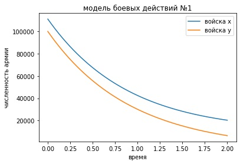
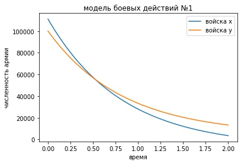
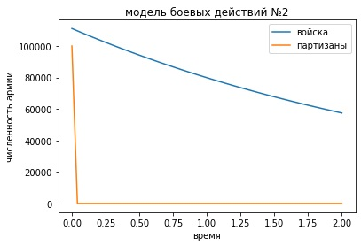
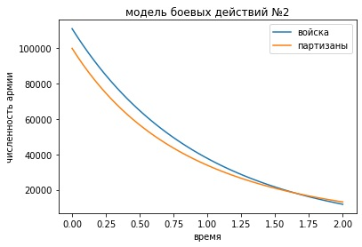

---
# Front matter
lang: ru-RU
title: "Отчет по лабораторной работе №3"
subtitle: "Модель боевых действий. Вариант 33"
author: "Соколова Анастасия Витальевна НФИбд-03-18"

# Formatting
toc-title: "Содержание"
toc: true # Table of contents
toc_depth: 2
lof: true # List of figures
fontsize: 12pt
linestretch: 1.5
papersize: a4paper
documentclass: scrreprt
polyglossia-lang: russian
polyglossia-otherlangs: english
mainfont: PT Serif
romanfont: PT Serif
sansfont: PT Sans
monofont: PT Mono
mainfontoptions: Ligatures=TeX
romanfontoptions: Ligatures=TeX
sansfontoptions: Ligatures=TeX,Scale=MatchLowercase
monofontoptions: Scale=MatchLowercase
indent: true
pdf-engine: lualatex
header-includes:
  - \linepenalty=10 # the penalty added to the badness of each line within a paragraph (no associated penalty node) Increasing the υalue makes tex try to haυe fewer lines in the paragraph.
  - \interlinepenalty=0 # υalue of the penalty (node) added after each line of a paragraph.
  - \hyphenpenalty=50 # the penalty for line breaking at an automatically inserted hyphen
  - \exhyphenpenalty=50 # the penalty for line breaking at an explicit hyphen
  - \binoppenalty=700 # the penalty for breaking a line at a binary operator
  - \relpenalty=500 # the penalty for breaking a line at a relation
  - \clubpenalty=150 # extra penalty for breaking after first line of a paragraph
  - \widowpenalty=150 # extra penalty for breaking before last line of a paragraph
  - \displaywidowpenalty=50 # extra penalty for breaking before last line before a display math
  - \brokenpenalty=100 # extra penalty for page breaking after a hyphenated line
  - \predisplaypenalty=10000 # penalty for breaking before a display
  - \postdisplaypenalty=0 # penalty for breaking after a display
  - \floatingpenalty = 20000 # penalty for splitting an insertion (can only be split footnote in standard LaTeX)
  - \raggedbottom # or \flushbottom
  - \usepackage{float} # keep figures where there are in the text
  - \floatplacement{figure}{H} # keep figures where there are in the text
---

# Цель работы

Рассмотреть простейшие модели боевых действий – модели Ланчестера.


# Задание

1. Рассмотреть модели боя в различных ситуациях
2. Построить графики в рассматриваемых случаях x(t) и y(t)
3. Опеределить победителя
4. Найти условие, при котором та или другая сторона выигрывают бой


# Выполнение лабораторной работы


## Условие задачи

Между страной Х и страной У идет война. Численность состава войск исчисляется от начала войны, и являются временными функциями
x(t) и y(t). В начальный момент времени страна Х имеет армию численностью 111 111 человек,
а в распоряжении страны У армия численностью в 99 999 человек. Для упрощения модели считаем, что коэффициенты a, b, c, h постоянны. Также считаем
P(t) и Q(t) непрерывные функции.

## Решение

1. Модель боевых действий между регулярными войсками.
Зададим коэффициент смертности, не связанный с боевыми действиями у первой армии 0,33, у второй 0,66. Коэффициенты эффективности первой и второй армии 0,44 и 0,77 соответственно. Функция, описывающая подход подкрепление первой армии, P(t)=sin(t+11), подкрепление второй армии описывается функцией Q(t)=cos(t+11). Система дифференциальных уравнений:
dx/dt = -0.33x(t)-0.77y(t)+P(t)
dy/dt = -0.44x(y)-0.66y(t)+Q(t)
*Код в среде python*
```python
    x0 = 111111
    y0 = 99999
    t0 = 0
    a = 0.60
    b = 0.77
    c = 0.44
    h = 0.66
    
    import numpy as np
    from scipy.integrate import odeint
    import matplotlib.pyplot as plt
    
    def P(t):
        p = np.sin(t+11)
    return p
    
    def Q(t):
        q = np.cos(t+11)
    return q
    
    def syst(y, t):
    return np.array([-a*y[0]-b*y[1]+P(t),-c*y[0]-h*y[1]+Q(t)])
        
    t = np.linspace(0, 2)
    v0 = np.array([x0, y0])

    res = odeint(syst, v0, t)
    
    plt.plot(t, res[:, 0])
    plt.plot(t, res[:, 1])
    plt.xlabel("время")
    plt.ylabel("численность армии")
    plt.title("модель боевых действий №1")
    plt.legend(["войска x", "войска y"])
    plt.show()
```

Получили данный график. (рис. [-@fig:001])



По данному графику видно, что первая армия выигрывает. Мы можем поменять условия, например, увеличить коэффициент смертности у первой армии до 0.60. Тогда получим следующий график, который демострирует победу второй армии. (рис. [-@fig:002])



2. Модель ведение боевых действий с участием регулярных войск и партизанских отрядов.
Коэффициент смертности, не связанный с боевыми действиями у армии - 0.33, у отряда - 0.88. Коэффициенты эффективности у армии - 0.22 и у отряда - 0.77. Функция, описывающая подход подкрепление армии, P(t)=sin(22t), подкрепление отряда описывается функцией Q(t)=cos(22t). Система дифференциальных уравнений:
dx/dt = -0.33x(t)-0.77y(t)+P(t)
dy/dt = -0.22x(y)y(t)-0.88y(t)+Q(t)

Получили данный график. (рис. [-@fig:003])



По данному графику видно, что армия выигрывает. Чтобы поменять условия так, чтобы польза стала в сторону отряда, надо поменять параметры. Для этого достаточно проанализировать упрощенную систему дифференциалных уравнений данной модели.
dx/dt=-by(t)
dy/dt=-cx(t)y(t)
И получаем то, что, чтобы выиграл отряд, нужно, чтобы неравенство b/2 * x(0)^2 < c * y(0) было верным. Подбираем значения коэффициентов:c=0.85, b=0.000003. Тогда получаем график: (рис. [-@fig:004])



# Выводы

- Рассмотрели некоторые модели боевых действий. 
- Провели анализ и смоделировали ситуацию. 
- Проверили, как работаем модель в различных ситуациях.