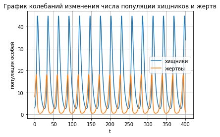
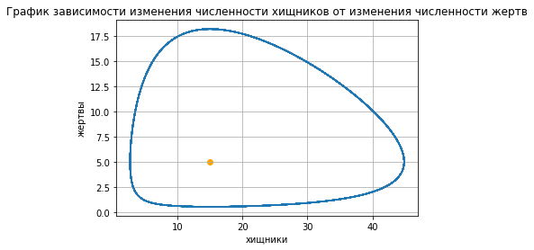

---
## Front matter
lang: ru-RU
title: Модель хищник-жертва
author: |
	 Соколова Анастасия Витальевна НФИбд-03-18\inst{1}

institute: |
	\inst{1}Российский Университет Дружбы Народов

## Formatting
mainfont: PT Serif
romanfont: PT Serif
sansfont: PT Sans
monofont: PT Mono
toc: false
slide_level: 2
theme: metropolis
header-includes: 
 - \metroset{progressbar=frametitle,sectionpage=progressbar,numbering=fraction}
 - '\makeatletter'
 - '\beamer@ignorenonframefalse'
 - '\makeatother'
aspectratio: 43
section-titles: true

---

# Цели и задачи работы

## Цель лабораторной работы

Рассмотреть и смоделировать простейшую модель взаимодействия двух видов типа «хищник — жертва» - модель Лотки-Вольтерры.

## Задание к лабораторной работе

Для заданной модели "хищник-жертва":
1. Построить график зависимости численности хищников от численности жертв
2. Построить графики изменения численности хищников и численности жертв
3. Найти стационарное состояние системы

# Процесс выполнения лабораторной работы

## Теоретическое введение

Данная двувидовая модель основывается на следующих предположениях:
1. Численность популяции жертв x и хищников y зависят только от времени
(модель не учитывает пространственное распределение популяции на
занимаемой территории)
2. В отсутствии взаимодействия численность видов изменяется по модели
Мальтуса, при этом число жертв увеличивается, а число хищников падает
3. Естественная смертность жертвы и естественная рождаемость хищника
считаются несущественными
4. Эффект насыщения численности обеих популяций не учитывается
5. Скорость роста численности жертв уменьшается пропорционально
численности хищников

## Краткое теоретическое введение

$$
  \begin{cases}
    \frac{dx}{dt} = ax(t) + bx(t)y(t)     \\
    \frac{dy}{dt} = cy(t) - dx(t)y(t)
  \end{cases}
$$

В этой модели x – число жертв, y - число хищников. Коэффициент a
описывает скорость естественного прироста числа жертв в отсутствие хищников, с
- естественное вымирание хищников, лишенных пищи в виде жертв. Вероятность
взаимодействия жертвы и хищника считается пропорциональной как количеству
жертв, так и числу самих хищников (xy). Каждый акт взаимодействия уменьшает
популяцию жертв, но способствует увеличению популяции хищников (члены -bxy
и dxy в правой части уравнения). 

## Теоретическое введение

Стационарное состояние системы (1) (положение равновесия, не зависящее
от времени решение) будет в точке: $$x_0 = \frac{c}{d}, y_0 = \frac{a}{b}$$ . Если начальные значения
задать в стационарном состоянии $$x(0) = x_0, y(0) = y_0$$, то в любой момент времени
численность популяций изменяться не будет. При малом отклонении от положения
равновесия численности как хищника, так и жертвы с течением времени не
возвращаются к равновесным значениям, а совершают периодические колебания
вокруг стационарной точки. Амплитуда колебаний и их период определяется
начальными значениями численностей x(0), y(0). Колебания совершаются в
противофазе.

## Выполнение

Построили графики колебаний изменения числа
популяции хищников и жертв от времени. (рис. [-@fig:001])

## Выполнение

Построили график зависимости изменения
численности хищников от изменения численности жертв. (рис. [-@fig:002])

# Выводы по проделанной работе

## Вывод

- Рассмотрели модель Лотки-Вольтерры
- Построили график зависимости численности хищников от численности жертв
- Построили графики изменения численности хищников и численности жертв
- Нашли стационарное состояние системы