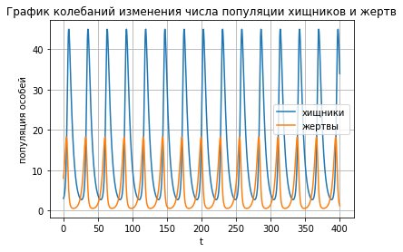
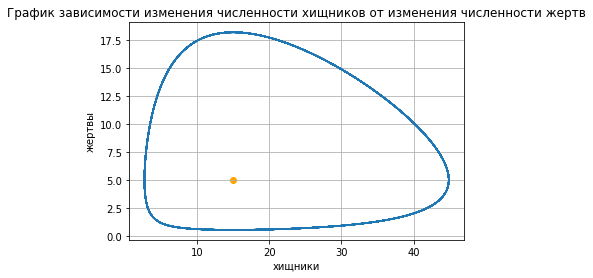

---
# Front matter
lang: ru-RU
title: "Отчет по лабораторной работе №5"
subtitle: "Модель хищник-жертва. Вариант 33"
author: "Соколова Анастасия Витальевна НФИбд-03-18"

# Formatting
toc-title: "Содержание"
toc: true # Table of contents
toc_depth: 2
lof: true # List of figures
fontsize: 12pt
linestretch: 1.5
papersize: a4paper
documentclass: scrreprt
polyglossia-lang: russian
polyglossia-otherlangs: english
mainfont: PT Serif
romanfont: PT Serif
sansfont: PT Sans
monofont: PT Mono
mainfontoptions: Ligatures=TeX
romanfontoptions: Ligatures=TeX
sansfontoptions: Ligatures=TeX,Scale=MatchLowercase
monofontoptions: Scale=MatchLowercase
indent: true
pdf-engine: lualatex
header-includes:
  - \linepenalty=10 # the penalty added to the badness of each line within a paragraph (no associated penalty node) Increasing the υalue makes tex try to haυe fewer lines in the paragraph.
  - \interlinepenalty=0 # υalue of the penalty (node) added after each line of a paragraph.
  - \hyphenpenalty=50 # the penalty for line breaking at an automatically inserted hyphen
  - \exhyphenpenalty=50 # the penalty for line breaking at an explicit hyphen
  - \binoppenalty=700 # the penalty for breaking a line at a binary operator
  - \relpenalty=500 # the penalty for breaking a line at a relation
  - \clubpenalty=150 # extra penalty for breaking after first line of a paragraph
  - \widowpenalty=150 # extra penalty for breaking before last line of a paragraph
  - \displaywidowpenalty=50 # extra penalty for breaking before last line before a display math
  - \brokenpenalty=100 # extra penalty for page breaking after a hyphenated line
  - \predisplaypenalty=10000 # penalty for breaking before a display
  - \postdisplaypenalty=0 # penalty for breaking after a display
  - \floatingpenalty = 20000 # penalty for splitting an insertion (can only be split footnote in standard LaTeX)
  - \raggedbottom # or \flushbottom
  - \usepackage{float} # keep figures where there are in the text
  - \floatplacement{figure}{H} # keep figures where there are in the text
---

# Цель работы

Изучить и построить простейшую модель взаимодействия двух видов типа «хищник — жертва» - модель Лотки-Вольтерры.


# Задание

Для заданной модели "хищник-жертва":
1. Построить график зависимости численности хищников от численности жертв
2. Построить графики изменения численности хищников и численности жертв
3. Найти стационарное состояние системы


# Выполнение лабораторной работы

## Условие задачи

Для модели «хищник-жертва»:

$$
  \begin{cases}
    \frac{dx}{dt} = - 0.22x(t) + 0.044x(t)y(t)     \\
    \frac{dy}{dt} = 0.33y(t) - 0.022x(t)y(t)
  \end{cases}
$$

Постройте график зависимости численности хищников от численности жертв,
а также графики изменения численности хищников и численности жертв при
следующих начальных условиях: $$x_0 = 3, y_0 = 8$$. Найдите стационарное
состояние системы.

## Теоретическое введение

Данная двувидовая модель основывается на следующих предположениях:
1. Численность популяции жертв x и хищников y зависят только от времени
(модель не учитывает пространственное распределение популяции на
занимаемой территории)
2. В отсутствии взаимодействия численность видов изменяется по модели
Мальтуса, при этом число жертв увеличивается, а число хищников падает
3. Естественная смертность жертвы и естественная рождаемость хищника
считаются несущественными
4. Эффект насыщения численности обеих популяций не учитывается
5. Скорость роста численности жертв уменьшается пропорционально
численности хищников

$$
  \begin{cases}
    \frac{dx}{dt} = ax(t) + bx(t)y(t)     \\
    \frac{dy}{dt} = cy(t) - dx(t)y(t)
  \end{cases}
$$

В этой модели x – число жертв, y - число хищников. Коэффициент a
описывает скорость естественного прироста числа жертв в отсутствие хищников, с
- естественное вымирание хищников, лишенных пищи в виде жертв. Вероятность
взаимодействия жертвы и хищника считается пропорциональной как количеству
жертв, так и числу самих хищников (xy). Каждый акт взаимодействия уменьшает
популяцию жертв, но способствует увеличению популяции хищников (члены -bxy
и dxy в правой части уравнения). 

Стационарное состояние системы (1) (положение равновесия, не зависящее
от времени решение) будет в точке: $$x_0 = \frac{c}{d}, y_0 = \frac{a}{b}$$ . Если начальные значения
задать в стационарном состоянии $$x(0) = x_0, y(0) = y_0$$, то в любой момент времени
численность популяций изменяться не будет. При малом отклонении от положения
равновесия численности как хищника, так и жертвы с течением времени не
возвращаются к равновесным значениям, а совершают периодические колебания
вокруг стационарной точки. Амплитуда колебаний и их период определяется
начальными значениями численностей x(0), y(0). Колебания совершаются в
противофазе.

## Решение

1. Построили графики колебаний изменения числа
популяции хищников и жертв от времени. (рис. [-@fig:001])





2. Построили график зависимости изменения
численности хищников от изменения численности жертв. (рис. [-@fig:002])



3. 
*Код в среде python*
```python
    import numpy as np
    from scipy.integrate import odeint
    import matplotlib.pyplot as plt
    
    a = 0.22
    b = 0.044
    c = 0.33
    d = 0.022

    def syst(x, t):
        return np.array([-a*x[0]+b*x[0]*x[1], c*x[1]-d*x[0]*x[1]])

    t = np.linspace(0, 400, 4000)
    x0 = [3, 8]

    y = odeint(syst, x0, t)

    plt.plot(t, y[:, 0])
    plt.plot(t, y[:, 1])
    plt.title("График колебаний изменения числа популяции хищников и жертв")
    plt.xlabel("t")
    plt.ylabel("популяция особей")
    plt.legend(["хищники","жертвы"])
    plt.grid()
    plt.show()

    plt.plot(y[:, 0], y[:, 1])
    plt.scatter(c/d, a/b, color='orange') #станционарная точка
    plt.title("График зависимости изменения численности хищников от изменения численности жертв")
    plt.xlabel("хищники")
    plt.ylabel("жертвы")
    plt.grid()
    plt.show()
```


# Выводы

- Рассмотрели модель Лотки-Вольтерры
- Построили график зависимости численности хищников от численности жертв
- Построили графики изменения численности хищников и численности жертв
- Нашли стационарное состояние системы