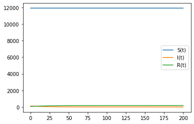
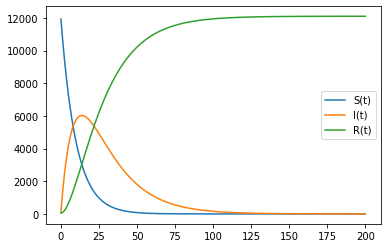

---
## Front matter
lang: ru-RU
title: Модель эпидемии
author: |
	 Соколова Анастасия Витальевна НФИбд-03-18\inst{1}

institute: |
	\inst{1}Российский Университет Дружбы Народов

## Formatting
mainfont: PT Serif
romanfont: PT Serif
sansfont: PT Sans
monofont: PT Mono
toc: false
slide_level: 2
theme: metropolis
header-includes: 
 - \metroset{progressbar=frametitle,sectionpage=progressbar,numbering=fraction}
 - '\makeatletter'
 - '\beamer@ignorenonframefalse'
 - '\makeatother'
aspectratio: 43
section-titles: true

---

# Цели и задачи работы

## Цель лабораторной работы

Рассмотреть и построить модель эпидемии.

## Задание к лабораторной работе

Для заданных начальных условий и коэффициентов пропорциональности построить графики 
изменения числа особей в каждой из трех групп. Рассмотреть, как будет протекать эпидемия в случае:
  1.если I(0)<=I*
  2.если I(0)>I*

# Процесс выполнения лабораторной работы

## Теоретическое введение

Предположим, что некая популяция, состоящая из N особей, подразделяется на три группы. 
S(t) - это восприимчивые к болезни, но пока здоровые особи. I(t) – это число
инфицированных особей, которые также при этом являются распространителями
инфекции. А R(t) – это здоровые особи с иммунитетом к болезни.

## Теоретическое введение

Cкорость изменения числа S(t) меняется по следующему закону:
$$
  \frac{dS}{dt} = \begin{cases}
     -aS, I(t)>I^*     \\
      0, I(t)<=I^*
  \end{cases}
$$ 

## Теоретическое введение

Скорость изменения числа инфекционных особей представляет разность за единицу времени между
заразившимися и теми, кто уже болеет и лечится:
$$
  \frac{dI}{dt} = \begin{cases}
     aS-bI, если I(t)>I^*     \\
      -bI, если I(t)<=I^*
  \end{cases}
$$

## Теоретическое введение

А скорость изменения выздоравливающих особей (при этом приобретающие
иммунитет к болезни):
$$ \frac{dR}{dt} = bI $$

Постоянные пропорциональности a,b - это коэффициенты заболеваемости
и выздоровления соответственно.

## Выполнение

## Выполнение

# Выводы по проделанной работе

## Вывод

- Рассмотрела модель эпидемии
- Рассмотрела протекание эпидемии в разных случаях
- Построила графики изменения числа людей в каждой группе