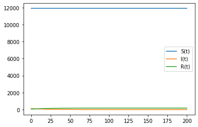
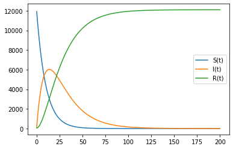

---
# Front matter
lang: ru-RU
title: "Отчет по лабораторной работе №6"
subtitle: "Задача об эпидемии. Вариант 33"
author: "Соколова Анастасия Витальевна НФИбд-03-18"

# Formatting
toc-title: "Содержание"
toc: true # Table of contents
toc_depth: 2
lof: true # List of figures
fontsize: 12pt
linestretch: 1.5
papersize: a4paper
documentclass: scrreprt
polyglossia-lang: russian
polyglossia-otherlangs: english
mainfont: PT Serif
romanfont: PT Serif
sansfont: PT Sans
monofont: PT Mono
mainfontoptions: Ligatures=TeX
romanfontoptions: Ligatures=TeX
sansfontoptions: Ligatures=TeX,Scale=MatchLowercase
monofontoptions: Scale=MatchLowercase
indent: true
pdf-engine: lualatex
header-includes:
  - \linepenalty=10 # the penalty added to the badness of each line within a paragraph (no associated penalty node) Increasing the υalue makes tex try to haυe fewer lines in the paragraph.
  - \interlinepenalty=0 # υalue of the penalty (node) added after each line of a paragraph.
  - \hyphenpenalty=50 # the penalty for line breaking at an automatically inserted hyphen
  - \exhyphenpenalty=50 # the penalty for line breaking at an explicit hyphen
  - \binoppenalty=700 # the penalty for breaking a line at a binary operator
  - \relpenalty=500 # the penalty for breaking a line at a relation
  - \clubpenalty=150 # extra penalty for breaking after first line of a paragraph
  - \widowpenalty=150 # extra penalty for breaking before last line of a paragraph
  - \displaywidowpenalty=50 # extra penalty for breaking before last line before a display math
  - \brokenpenalty=100 # extra penalty for page breaking after a hyphenated line
  - \predisplaypenalty=10000 # penalty for breaking before a display
  - \postdisplaypenalty=0 # penalty for breaking after a display
  - \floatingpenalty = 20000 # penalty for splitting an insertion (can only be split footnote in standard LaTeX)
  - \raggedbottom # or \flushbottom
  - \usepackage{float} # keep figures where there are in the text
  - \floatplacement{figure}{H} # keep figures where there are in the text
---

# Цель работы

Рассмотреть и построить модель эпидемии.


# Задание

Для заданных начальных условий и коэффициентов пропорциональности построить графики 
изменения числа особей в каждой из трех групп. Рассмотреть, как будет протекать эпидемия в случае:
 1. если I(0)<=I*
 2. если I(0)>I*

# Выполнение лабораторной работы

## Условие задачи

На одном острове вспыхнула эпидемия. Известно, что из всех проживающих
на острове (N=12 100) в момент начала эпидемии (t=0) число заболевших людей
(являющихся распространителями инфекции) I(0)=120, А число здоровых людей с
иммунитетом к болезни R(0)=52. Таким образом, число людей восприимчивых к
болезни, но пока здоровых, в начальный момент времени S(0)=N-I(0)- R(0).
Постройте графики изменения числа особей в каждой из трех групп.
Рассмотрите, как будет протекать эпидемия в обоих случаях.

## Теоретическое введение

Предположим, что некая популяция, состоящая из N особей, (считаем, что популяция изолирована)
подразделяется на три группы. Первая группа - это восприимчивые к болезни, но
пока здоровые особи, обозначим их через S(t). Вторая группа – это число
инфицированных особей, которые также при этом являются распространителями
инфекции, обозначим их I(t). А третья группа, обозначающаяся через R(t) – это
здоровые особи с иммунитетом к болезни. 

До того, как число заболевших не превышает критического значения I*, 
считаем, что все больные изолированы и не заражают здоровых. Когда I(t)>I*,
тогда инфицирование способны заражать восприимчивых к болезни особей. 

Таким образом, скорость изменения числа S(t) меняется по следующему
закону:
$$
  \frac{dS}{dt} = \begin{cases}
     -aS, если I(t)>I^*     \\
      0, если I(t)<=I^*
  \end{cases}
$$

Поскольку каждая восприимчивая к болезни особь, которая, в конце концов,
заболевает, сама становится инфекционной, то скорость изменения числа
инфекционных особей представляет разность за единицу времени между
заразившимися и теми, кто уже болеет и лечится, т.е.:
$$
  \frac{dI}{dt} = \begin{cases}
     aS-bI, если I(t)>I^*     \\
      -bI, если I(t)<=I^*
  \end{cases}
$$

А скорость изменения выздоравливающих особей (при этом приобретающие
иммунитет к болезни):
$$ \frac{dR}{dt} = bI $$

Постоянные пропорциональности a,b - это коэффициенты заболеваемости
и выздоровления соответственно.

## Решение

1. Построила график изменения числа людей в каждой из трех групп в случае,
когда I(t)<=I*.





2. Построила график изменения числа людей в каждой из трех групп в случае,
когда I(t)>I*.



3. 
*Код в среде python*
```python
    import numpy as np
    from scipy.integrate import odeint
    import matplotlib.pyplot as plt
    
    N = 12100
    I0 = 120 #число инфицированных
    R0 = 52 #здоровые с имунитетом
    S0 = N - I0 - R0 #здоровые, но восприимчивые к болезни
    a = 0.10 #коэф заболеваемости
    b = 0.05 #коеф выздоровления

    #I(0)<=I*
    def syst(x, t):
       return np.array([0, -b*x[1], b*x[1]])

    #I(0)>I*
    def syst1(x, t):
        return np.array([-a*x[0], a*x[0]-b*x[1], b*x[1]])

    t0 = 0
    x0 = np.array([S0, I0, R0])
    t = np.linspace(0, 200, 2000)

    y = odeint(syst, x0, t)

    plt.plot(t, y)
    plt.legend(["S(t)","I(t)","R(t)"])
    plt.show()
```


# Выводы

- Рассмотрела модель эпидемии
- Рассмотрела протекание эпидемии в разных случаях
- Построила графики изменения числа людей в каждой группе