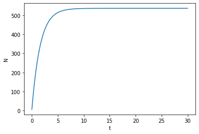
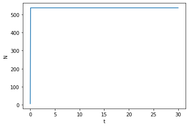
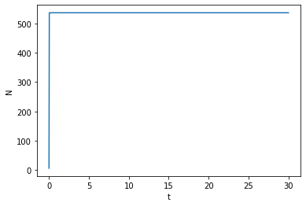
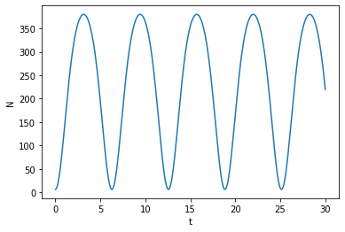
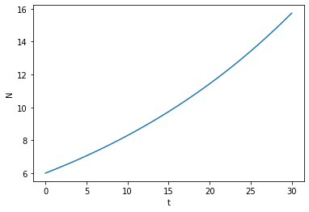

---
# Front matter
lang: ru-RU
title: "Отчет по лабораторной работе №7"
subtitle: "Эффективность рекламы. Вариант 33"
author: "Соколова Анастасия Витальевна НФИбд-03-18"

# Formatting
toc-title: "Содержание"
toc: true # Table of contents
toc_depth: 2
lof: true # List of figures
fontsize: 12pt
linestretch: 1.5
papersize: a4paper
documentclass: scrreprt
polyglossia-lang: russian
polyglossia-otherlangs: english
mainfont: PT Serif
romanfont: PT Serif
sansfont: PT Sans
monofont: PT Mono
mainfontoptions: Ligatures=TeX
romanfontoptions: Ligatures=TeX
sansfontoptions: Ligatures=TeX,Scale=MatchLowercase
monofontoptions: Scale=MatchLowercase
indent: true
pdf-engine: lualatex
header-includes:
  - \linepenalty=10 # the penalty added to the badness of each line within a paragraph (no associated penalty node) Increasing the υalue makes tex try to haυe fewer lines in the paragraph.
  - \interlinepenalty=0 # υalue of the penalty (node) added after each line of a paragraph.
  - \hyphenpenalty=50 # the penalty for line breaking at an automatically inserted hyphen
  - \exhyphenpenalty=50 # the penalty for line breaking at an explicit hyphen
  - \binoppenalty=700 # the penalty for breaking a line at a binary operator
  - \relpenalty=500 # the penalty for breaking a line at a relation
  - \clubpenalty=150 # extra penalty for breaking after first line of a paragraph
  - \widowpenalty=150 # extra penalty for breaking before last line of a paragraph
  - \displaywidowpenalty=50 # extra penalty for breaking before last line before a display math
  - \brokenpenalty=100 # extra penalty for page breaking after a hyphenated line
  - \predisplaypenalty=10000 # penalty for breaking before a display
  - \postdisplaypenalty=0 # penalty for breaking after a display
  - \floatingpenalty = 20000 # penalty for splitting an insertion (can only be split footnote in standard LaTeX)
  - \raggedbottom # or \flushbottom
  - \usepackage{float} # keep figures where there are in the text
  - \floatplacement{figure}{H} # keep figures where there are in the text
---

# Цель работы

Рассмотреть и построить модель рекламной кампании.

# Задание

- Построить графики распространения рекламы для 3 случаев
- Определить в какой момент времени эффективность рекламы будет иметь
максимально быстрый рост во 2 случае
- Построить решение, если учитывать вклад только платной рекламы
- Построить решение, если предположить, что информация о товаре
распространятся только путем «сарафанного радио»

# Выполнение лабораторной работы

## Условие задачи

Постройте график распространения рекламы, математическая модель которой описывается
следующим уравнением:
1. $ \frac{dn}{dt} = (0.61 + 0.000061n(t))(N-n(t)) $
2. $ \frac{dn}{dt} = (0.000061 + 0.61n(t))(N-n(t)) $
3. $ \frac{dn}{dt} = (0.61sin(t) + 0.61cos(t)n(t))(N-n(t)) $
При этом объем аудитории N=537, в начальный момент о товаре знает 6 человек. Для
случая 2 определите в какой момент времени скорость распространения рекламы будет
иметь максимальное значении.

## Теоретическое введение

Считаем, что $\frac{dn}{dt}$ - скорость изменения со временем числа потребителей,
узнавших о товаре и готовых его купить, t - время, прошедшее с начала рекламной
кампании, $n(t)$ - число уже информированных клиентов. Эта величина
пропорциональна числу покупателей, еще не знающих о нем, это описывается
следующим образом: $a_1(t)(N-n(t))$ , где N - общее число потенциальных
платежеспособных покупателей, $a_1(t)>0$ - характеризует интенсивность
рекламной кампании (зависит от затрат на рекламу в данный момент времени).
Помимо этого, узнавшие о товаре потребители также распространяют полученную
информацию среди потенциальных покупателей, не знающих о нем (в этом случае
работает т.н. сарафанное радио). Этот вклад в рекламу описывается величиной
$a_2(t)(N-n(t))$ , эта величина увеличивается с увеличением потребителей
узнавших о товаре. Математическая модель распространения рекламы описывается
уравнением: $$ \frac{dn}{dt} = (a_1(t) + a_2(t)n(t))(N-n(t)) $$

## Решение

1. Построила график распространения рекламы о товаре с учетом платной
рекламы и с учетом сарафанного радио для 1 случая. (рис. [-@fig:001])



2. Построила график распространения рекламы о товаре с учетом платной
рекламы и с учетом сарафанного радио для 2 случая. (рис. [-@fig:002])
Скорость распространения рекламы будет иметь максимальное значение при t~0



3. Построила график распространения рекламы о товаре с учетом платной
рекламы и с учетом сарафанного радио для 3 случая. (рис. [-@fig:003])



4. Построила решение, учитывая вклад только платной рекламы, для 1 и 3 случаев. (рис. [-@fig:004]) (рис. [-@fig:006])




5. Построила решение, предполагая, что информация о товаре распространятся только путем «сарафанного радио». (рис. [-@fig:005]) (рис. [-@fig:007])




6. 
*Код в среде python*
```python
    import numpy as np
    from scipy.integrate import odeint
    import matplotlib.pyplot as plt
    
    x0 = 6
    N = 537
    t = np.linspace(0,30,500)

    def k(t):
        #return 0.61
        #return 0.000061
        return 0.61*np.sin(t)

    def p(t):
        #return 0.000061
        #return 0.61
        return 0.61*np.cos(t)

    def f(x,t):
        return (k(t)+p(t)*x)*(N-x)

    x = odeint(f, x0, t)

    plt.plot(t, x)
    plt.xlabel('t')
    plt.ylabel('N')
    plt.show()
```

# Выводы

- Рассмотрела модель рекламной кампании
- Построила графики распространения рекламы для различных случаев
- Построила решения, учитывая только вклад платной рекламы
- Построила решения, учитывая только вклад «сарафанного радио»
- Проанализировала эффективность платной рекламы и «сарафанного радио»