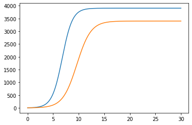
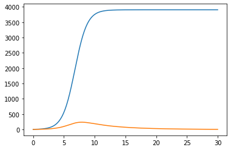

---
# Front matter
lang: ru-RU
title: "Отчет по лабораторной работе №8"
subtitle: "Модель конкуренции двух фирм. Вариант 33"
author: "Соколова Анастасия Витальевна НФИбд-03-18"

# Formatting
toc-title: "Содержание"
toc: true # Table of contents
toc_depth: 2
lof: true # List of figures
fontsize: 12pt
linestretch: 1.5
papersize: a4paper
documentclass: scrreprt
polyglossia-lang: russian
polyglossia-otherlangs: english
mainfont: PT Serif
romanfont: PT Serif
sansfont: PT Sans
monofont: PT Mono
mainfontoptions: Ligatures=TeX
romanfontoptions: Ligatures=TeX
sansfontoptions: Ligatures=TeX,Scale=MatchLowercase
monofontoptions: Scale=MatchLowercase
indent: true
pdf-engine: lualatex
header-includes:
  - \linepenalty=10 # the penalty added to the badness of each line within a paragraph (no associated penalty node) Increasing the υalue makes tex try to haυe fewer lines in the paragraph.
  - \interlinepenalty=0 # υalue of the penalty (node) added after each line of a paragraph.
  - \hyphenpenalty=50 # the penalty for line breaking at an automatically inserted hyphen
  - \exhyphenpenalty=50 # the penalty for line breaking at an explicit hyphen
  - \binoppenalty=700 # the penalty for breaking a line at a binary operator
  - \relpenalty=500 # the penalty for breaking a line at a relation
  - \clubpenalty=150 # extra penalty for breaking after first line of a paragraph
  - \widowpenalty=150 # extra penalty for breaking before last line of a paragraph
  - \displaywidowpenalty=50 # extra penalty for breaking before last line before a display math
  - \brokenpenalty=100 # extra penalty for page breaking after a hyphenated line
  - \predisplaypenalty=10000 # penalty for breaking before a display
  - \postdisplaypenalty=0 # penalty for breaking after a display
  - \floatingpenalty = 20000 # penalty for splitting an insertion (can only be split footnote in standard LaTeX)
  - \raggedbottom # or \flushbottom
  - \usepackage{float} # keep figures where there are in the text
  - \floatplacement{figure}{H} # keep figures where there are in the text
---

# Цель работы

Рассмотреть и построить модель конкуренции двух фирм

# Задание

- Построить графики изменения оборотных средств фирмы 1 и фирмы 2 без
учета постоянных издержек и с веденной нормировкой для случая 1.
- Построить графики изменения для случая 2.
- Проанализировать полученные результаты.

# Выполнение лабораторной работы

## Условие задачи

$$
 \begin{cases}
     \frac{dM_1}{d\theta}=M_1-\frac{b}{c_1}M_1M_2-\frac{a_1}{c_1}M^2_1 \\
     \frac{dM_2}{d\theta}=\frac{c_2}{c_1}M_1-\frac{b}{c_1}M_1M_2-\frac{a_2}{c_1}M^2_2
  \end{cases}
$$(1)

$$
 \begin{cases}
     \frac{dM_1}{d\theta}=M_1-\frac{b}{c_1}M_1M_2-\frac{a_1}{c_1}M^2_1 \\
     \frac{dM_2}{d\theta}=\frac{c_2}{c_1}M_1-(\frac{b}{c_1}+0.00023)M_1M_2-\frac{a_2}{c_1}M^2_2
  \end{cases}
$$(2)

Для обоих случаев рассмотрим задачу со следующими начальными условиями и
параметрами:
$$M^1_0=4.4, M^2_0=3.1$$
$$p_{cr}=29, N=35, q=1$$
$$r_1=21, r_2=14$$
$$p_1=7, p_2=11.5$$s

## Теоретическое введение

Для построения модели конкуренции двух фирм необходимо рассмотреть модель одной фирмы. Вначале рассмотрим модель фирмы, производящей продукт 
долговременного пользования, когда цена его определяется балансом спроса и предложения. Примем, что этот продукт занимает определенную нишу 
рынка и конкуренты в ней отсутствуют. 

Обозначим:
$N$ - число потребителей производимого продукта
$S$ – доходы потребителей данного продукта. Считаем, что доходы всех потребителей одинаковы. Это предположение справедливо, 
если речь идет об одной рыночной нише, т.е. производимый продукт ориентирован на определенный слой населения. 
$M$ – оборотные средства предприятия 
$\tau$ - длительность производственного цикла
$p$ - рыночная цена товара 
$\widetilde{p}$ - себестоимость продукта, то есть переменные издержки на производство единицы продукции
$\delta$ - доля оборотных средств, идущая на покрытие переменных издержек
$k$ - постоянные издержки, которые не зависят от количества выпускаемой продукции
$Q(S/p)$ – функция спроса, зависящая от отношения дохода $S$ к цене $p$. Она равна количеству продукта, потребляемого одним потребителем в единицу времени.

Функцию спроса товаров долговременного использования часто представляют в простейшей форме: 
$$Q = q - k\frac{p}{S} = q(1 - \frac{p}{p_{cr}})$$
где $q$ – максимальная потребность одного человека в продукте в единицу времени.
Эта функция падает с ростом цены и при $p = p_{cr}$ (критическая стоимость продукта) потребители отказываются от приобретения товара. 
Величина $p_{cr} = Sq/k$. Параметр $k$ – мера эластичности функции спроса по цене. Таким образом, 
функция спроса является пороговой (то есть, $Q(S/p) = 0$ при $p \geq p_{cr}$) и обладает свойствами насыщения.

Уравнения динамики оборотных средств можно записать в виде:
$$\frac{dM}{dt} = -\frac{M \delta}{\tau} + NQp - k = -\frac{M\delta}{\tau} + Nq(1 - \frac{p}{p_{cr}})p - k$$

Уравнение для рыночной цены $p$ представим в виде:
$$\frac{dp}{dt} = \gamma (-\frac{M\delta}{\tau \widetilde{p}} + Nq(1-\frac{p}{p_{cr}}) )$$

Первый член соответствует количеству поставляемого на рынок товара (то есть, предложению), а второй член – спросу.
Параметр $\gamma$ зависит от скорости оборота товаров на рынке. Как правило, время торгового оборота существенно меньше времени 
производственного цикла $\tau$. При заданном M уравнение описывает быстрое стремление цены к равновесному значению цены, которое устойчиво.

В этом случае уравнение можно заменить алгебраическим соотношением
$$ -\frac{M\delta}{\tau \widetilde{p}} + Nq(1-\frac{p}{p_{cr}}) = 0$$

равновесное значение цены $p$ равно
$$ p = p_{cr}(1 - \frac{M\delta}{\tau \widetilde{p} Nq})$$

Тогда уравнения динамики оборотных средств приобретает вид
$$\frac{dM}{dt} = -\frac{M \delta}{\tau}(\frac{p}{p_{cr}}-1) - M^2 ( \frac{\delta}{\tau \widetilde{p} })^2 \frac{p_{cr}}{Nq} - k$$

Это уравнение имеет два стационарных решения, соответствующих условию $dM/dt=0$
$$ \widetilde{M_{1,2}} = \frac{1}{2} a \pm \sqrt{\frac{a^2}{4} - b}$$
где
$$ a = Nq(1 - \frac{\widetilde{p}}{p_{cr}} \widetilde{p} \frac{\tau}{\delta}), b = kNq \frac{(\tau \widetilde{p})^2}{p_{cr}\delta ^2} $$

Получается, что при больших постоянных издержках (в случае $a^2 < 4b$) стационарных состояний нет. Это означает, что в этих условиях фирма 
не может функционировать стабильно, то есть, терпит банкротство. Однако, как правило, постоянные затраты малы по сравнению 
с переменными (то есть, $b << a^2$) и играют роль, только в случае, когда оборотные средства малы. 

При $b << a$ стационарные значения $M$ равны
$$ \widetilde{M_{+}} = Nq \frac{\tau}{\delta}(1 - \frac{\widetilde{p}}{p_{cr}})\widetilde{p}, \widetilde{M_{-}} = k\widetilde{p} \frac{\tau}{\delta(p_{cr} - \widetilde{p})} $$

Первое состояние $\widetilde{M_{+}}$ устойчиво и соответствует стабильному функционированию предприятия. 
Второе состояние \widetilde{M_{-} неустойчиво, так, что при $M < \widetilde{M_{-}}$ оборотные средства падают ($dM/dt < 0$), 
то есть, фирма идет к банкротству. По смыслу $\widetilde{M_{-}}$ соответствует начальному капиталу, необходимому для входа в рынок.

В обсуждаемой модели параметр $\delta$ всюду входит в сочетании с $\tau$. Это значит, что уменьшение доли оборотных средств, 
вкладываемых в производство, эквивалентно удлинению производственного цикла. Поэтому мы в дальнейшем положим: $\delta = 1$, а 
параметр $\tau$ будем считать временем цикла, с учётом сказанного.

## Решение

1. Построила график изменения оборотных средств двух фирм для 1 случая, когда
конкуренты могут влиять на противника путем изменения параметров своего
производства: себестоимость, время цикла, но не могут прямо вмешиваться в
ситуацию на рынке («назначать» цену или влиять на потребителей каким-либо иным
способом.) (рис. -@fig:001)



2. Построила график изменения оборотных средств двух фирм для 2 случая, когда, помимо экономического фактора
влияния (изменение себестоимости, производственного цикла, использование
кредита и т.п.), используются еще и социально-психологические факторы –
формирование общественного предпочтения одного товара другому, не зависимо от
их качества и цены. (рис. -@fig:002)



3. 
*Код в среде python*
```python
    import numpy as np
    from scipy.integrate import odeint
    import matplotlib.pyplot as plt
    
    p_cr = 29 #критическая стоимость продукта
    tau1 = 21 #длительность производственного цикла фирмы 1
    p1 = 7 #себестоимость продукта у фирмы 1
    tau2 = 14 #длительность производственного цикла фирмы 2
    p2 = 11.5 #себестоимость продукта у фирмы 2
    V = 35 #число потребителей производимого продукта
    q = 1 #максимальная потребность одного человека в продукте в единицу времени

    a1 = p_cr/(tau1*tau1*p1*p1*V*q)
    a2 = p_cr/(tau2*tau2*p2*p2*V*q)
    b = p_cr/(tau1*tau1*tau2*tau2*p1*p1*p2*p2*V*q)
    c1 = (p_cr-p1)/(tau1*p1)
    c2 = (p_cr-p2)/(tau2*p2)

    def syst(x, t): #случай 1
        return np.array([x[0] - (a1/c1)*x[0]*x[0] - (b/c1)*x[0]*x[1], (c2/c1)*x[1] - (a2/c1)*x[1]*x[1] - (b/c1)*x[0]*x[1]])

    def syst1(x, t): #случай 2
        return np.array([x[0] - (a1/c1)*x[0]*x[0] - (b/c1)*x[0]*x[1], (c2/c1)*x[1] - (a2/c1)*x[1]*x[1] - ((b/c1)+0.00023)*x[0]*x[1]])

    x0 = np.array([4.4, 3.1]) #начальное значение объема оборотных средств x1 и х2
    t = np.linspace(0, 30, 500)
    y = odeint(syst1, x0, t)

    plt.plot(t, y)
    plt.show()
```

# Выводы

- Рассмотрела модель 
- Построила графики изменения оборотных средств фирмы 1 и фирмы 2 без
учета постоянных издержек и с веденной нормировкой для случая 1
- Построила графики изменения для случая 2